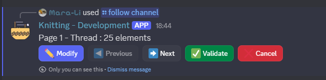

# Ignore

Exclude text channels[^1] and/or roles from the auto-invitation done by Knitting.

> [!WARNING]
> You cannot “follow” and “ignore” at the same time. For example:
> - If you have enabled <mark>channel only</mark> mode, you cannot ignore a channel[^1].
> - If you have enabled <mark>role only</mark> mode, you cannot ignore a role.
> - You cannot use the other configurations if you have enabled <mark>[@role] in [#channel]</mark>.

## Ignore text channels

> [!info]
> **`/ignore channel [type]`**
> - **`type`** : `Channel` | `thread` | `forum` | `category`

This command cannot be used if the <mark>channel only</mark> mode is enabled.

As with [`follow channel`](follow.md#Follow%20text%20channels), you need to specify the type you want to manage and then manipulate the selections in the modal.

> [!warning]
> Discord limits selections to a maximum of 25. If you need to have more than 25 items, paginated menus will open: 
> If you need to follow a large number of rooms, we recommend managing threads using categories.

## Ignore roles

> [!info]
> `/ignore role`

Like the previous command, this command can only be used when <mark>role only</mark> mode is **disabled**.

You can only manage a maximum of 25 roles.

## Ignore specific

> [!info]
> `/ignore specific [@role] [type]`
> - **`@role`** : The role to manage
> - **`type`** : `Channel` | `thread` | `forum` | `category` | `delete`

This mode can only be used if <mark>follow [@role] in [#channel]</mark> is **disabled**.

Just like [ignore text channels](#Ignore%20text%20channels), there is a pagination system for managing more than 25 text rooms at once.

To remove a role, simply select `delete` in the type.

## Display the ignored list

> [!info]
> `/ignore list`

Display the channel and roles ignored.

[^1]: Channel includes here thread, channel, forum and category.
